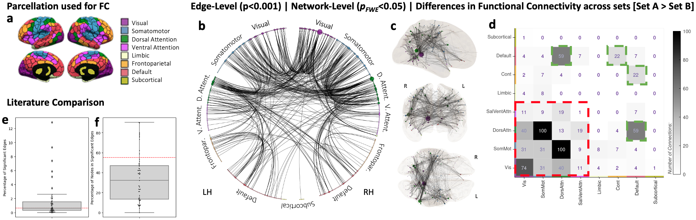
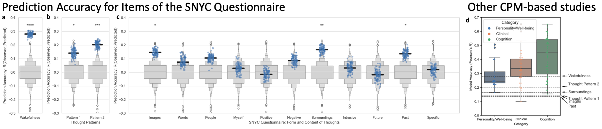

# Project Description

This repository contains the code associated with the publication: ["In-Scanner Thoughts shape Resting-state Functional Connectivity: how
participants 'rest' matters"](https://www.biorxiv.org/content/10.1101/2024.06.05.596482v1).

In this work, we show that resting-state scans that systematically differ in terms of in-scanner experience (trait-level aspects) show wide-spread significant differences in functional connectivity

And also, that some aspects of that experience can be predicted using static functional connectivity estimates

Information about software requirements and how to run this code are be available [project wiki](../../wiki).

***
